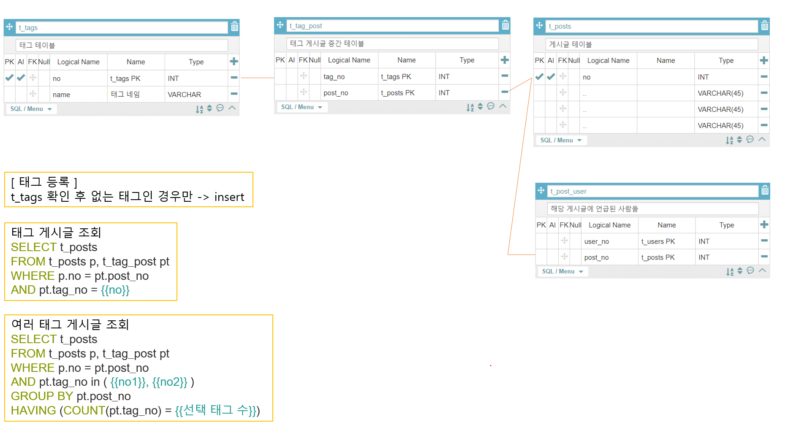

[TOC]

---

# 1 t_tags

| column  | type    | description |
| ------- | ------- | ----------- |
| pid     | INT     | PK          |
| post_id | INT     | 게시글 PK   |
| name    | VARCHAR | 태그 네임   |

ex)

| t_tags PK | 게시글 번호 | 태그 네임 |
| --------- | ----------- | --------- |
| 1         | 1           | 존맛      |
| 2         | 2           | 존맛      |

> 1번 게시글과 2번 게시글에서 사용하는 태그가 같은 경우 계속 중복 데이터 생김

<br>

# 2 ManyToMany 

## > t_tags, t_tag_post, t_posts

**t_tags**

| column | type    | description |
| ------ | ------- | ----------- |
| pid    | INT     | PK          |
| name   | VARCHAR | 태그 네임   |

**t_tag_post**

| column  | type | description |
| ------- | ---- | ----------- |
| tag_no  | INT  | t_tags PK   |
| post_no | INT  | t_posts PK  |

> 사용자가 태그 걸 때 t_tags에 있는 태그면 pass, 없으면 insert 


<br>


# 3 tag + post + user



**쿼리수정** 

```sql
SELECT p.no, ....., t_name
FROM t_posts p, t_tags t, t_tag_post pt
WHERE p.no = pt.post_no
and t.no = pt.tag_no
AND pt_tag_no = {{no}}
```

```sql
SELECT p.no, ....., t_name
FROM t_posts p, t_tags t, t_tag_post pt
WHERE p.no = pt.post_no
and t.no = pt.tag_no
AND pt_tag_no in ( {{no1}}, {{no2}} )
GROUP BY pt.post_no
HAVING ( COUNT(pt.tag_no) = {{선택 태그 개수}} )
```


> 댓글에서 언급하는 경우는 db에 안넣고
>
> 그냥 # + tag입력 -> 클릭 -> 해당 게시글 조회 만 하면 될 것 같음.. (고민..)


